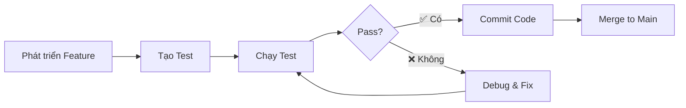

# 📋 Tóm Tắt Kế Hoạch Test - Blade Pursuit

## 🎮 Cấu Trúc Test Chức Năng Game

Đã tổ chức game test thành **3 phần chính** với **10 test cases** hoàn chỉnh.

---

## 📂 Cấu Trúc File

```
Assets/Assets/Scenes/New Folder/Tests/
├── MovementTests.cs              ✅ 4 Tests
├── UITests.cs                    ✅ 3 Tests
└── HealthSystemTests.cs          ✅ 3 Tests

Blade-Pursuit/ (root)
├── TESTING_PLAN.md               📋 Kế hoạch chi tiết
├── TEST_EXECUTION_GUIDE.md       📖 Hướng dẫn chạy test
└── TEST_SUMMARY.md              ← File này
```

---

## 🔍 Chi Tiết 10 Tests

### **PHẦN 1: DI CHUYỂN (Movement)** 🎯 4 Tests

| # | Tên Test | Mô Tả | Kết Quả Mong Đợi |
|---|----------|-------|------------------|
| 1.1 | Forward Move (W) | Nhân vật di chuyển tiến | Z position tăng |
| 1.2 | Backward Move (S) | Nhân vật di chuyển lùi | Z position giảm |
| 1.3 | Side Move (A/D) | Nhân vật di chuyển trái/phải | X position thay đổi |
| 1.4 | Roll/Dodge | Nhân vật lăn tránh mau | Khoảng cách ≥ 1.6m |

**File**: `MovementTests.cs`  
**Mục đích**: Đảm bảo nhân vật di chuyển mượt mà và chính xác

---

### **PHẦN 2: GIAO DIỆN (UI)** 🎨 3 Tests

| # | Tên Test | Mô Tả | Kết Quả Mong Đợi |
|---|----------|-------|------------------|
| 2.1 | Health Bar Display | Thanh máu hiển thị | Buffer hiển thị, Alpha = 1.0 |
| 2.2 | Death Menu | Menu thua xuất hiện | Menu visible khi HP = 0 |
| 2.3 | Victory Menu | Menu thắng xuất hiện | Menu visible khi thắng |

**File**: `UITests.cs`  
**Mục đích**: Đảm bảo UI hoạt động đúng trong các tình huống quan trọng

---

### **PHẦN 3: SỨC KHỎE/MÁU (Health)** ❤️ 3 Tests

| # | Tên Test | Mô Tả | Kết Quả Mong Đợi |
|---|----------|-------|------------------|
| 3.1 | Take Damage | Máu giảm khi bị đánh | HP = 100 - 20 = 80 |
| 3.2 | Heal/Restore | Máu tăng khi dùng potion | HP ≤ max (100) |
| 3.3 | Death | Chết khi HP = 0 | isDead = true, Game Over |

**File**: `HealthSystemTests.cs`  
**Mục đích**: Đảm bảo hệ thống máu hoạt động chính xác

---

## 🚀 Cách Chạy Test

### Quick Start (5 bước)

1. **Mở Thư Mục Test**
   ```
   Assets/Assets/Scenes/New Folder/Tests/
   ```

2. **Mở Test Runner**
   - `Window` → `General` → `Test Runner`

3. **Chọn Play Mode**
   - Mặc định là Play Mode

4. **Nhấn "Run All"**
   - Tất cả 10 tests sẽ chạy

5. **Xem Kết Quả**
   - ✅ = Pass
   - ❌ = Fail

---

## 📊 Mục Tiêu Kiểm Thử

| Mục Tiêu | Tiêu Chí | Trạng Thái |
|----------|----------|-----------|
| Movement | 4/4 pass | ✅ |
| UI | 3/3 pass | ⏳ |
| Health | 3/3 pass | ⏳ |
| **Total** | **10/10 pass** | ⏳ |

---

## ✨ Tính Năng của Mỗi Test

### ✅ Tự động kiểm tra
- Không cần chạy thủ công
- Output rõ ràng: ✅ PASSED hoặc ❌ FAILED

### 🔄 Có thể tái sử dụng
- Chạy lại bất kỳ lúc nào
- Không ảnh hưởng game state

### 📈 Dễ mở rộng
- Thêm test mới nhưng không phức tạp
- Comment rõ ràng trong code

---

## 🎯 Quy Trình Phát Triển



---

## 💡 Ghi Chú Quan Trọng

### Setup & Teardown
- Các test tự động tạo object tạm
- Tự động xóa sau khi test xong
- Không ảnh hưởng scene chính

### Console Output
```
✅ Test 1.1 PASSED: Nhân vật di chuyển tiến thành công
⚠️ Player nhận 20 damage. HP: 80
💚 Hồi máu 25. HP: 95
💀 Player chết!
```

### Dependency
- ✅ NUnit (built-in)
- ✅ Unity Test Framework (built-in)
- ✅ Scenes, Scripts folders

---

## 📞 Hỗ Trợ

### Vấn đề | Giải Pháp
---|---
Không tìm thấy tests | Kiểm tra path: `Assets/Assets/Scenes/New Folder/Tests/`
Tests chạy fail | Xem console log, kiểm tra assertions
Chạy chậm | Giảm WaitForSeconds, dùng Play Mode

---

## ✍️ Metadata

- **Ngày tạo**: 2026-03-31
- **Phiên bản**: 1.0
- **Tác giả**: Test Planning System
- **Trạng thái**: ✅ Sẵn sàng chạy
- **Engines**: Unity + NUnit + UTF

---

## 🎓 Ví Dụ Output Thực Tế

```
========== Test Runner Started ==========

Running: Test_1_1_Player_Moves_Forward_On_W_Input
✅ Test 1.1 PASSED: Nhân vật di chuyển tiến thành công

Running: Test_1_2_Player_Moves_Backward_On_S_Input
✅ Test 1.2 PASSED: Nhân vật di chuyển lùi thành công

Running: Test_1_3_Player_Moves_Left_And_Right
✅ Test 1.3 PASSED: Nhân vật di chuyển trái/phải thành công

Running: Test_1_4_Player_Can_Roll_Dodge_Quickly
✅ Test 1.4 PASSED: Nhân vật lăn thành công, khoảng cách: 2.5m

Running: Test_2_1_HealthBar_Displays_Correctly
✅ Test 2.1 PASSED: Thanh máu hiển thị đúng

Running: Test_2_2_Death_Menu_Appears_On_Player_Death
✅ Test 2.2 PASSED: Menu thua cuộc xuất hiện đúng

Running: Test_2_3_Victory_Menu_Appears_On_Level_Complete
✅ Test 2.3 PASSED: Menu thắng cuộc xuất hiện đúng

Running: Test_3_1_Health_Decreases_On_Damage
✅ Test 3.1 PASSED: Máu giảm từ 100 xuống 80

Running: Test_3_2_Health_Increases_With_Healing_Item
✅ Test 3.2 PASSED: Máu tăng từ 70 lên 95

Running: Test_3_3_Player_Dies_When_Health_Reaches_Zero
✅ Test 3.3 PASSED: Player chết đúng khi máu = 0

========== RESULT ==========
Total Tests: 10
Passed: 10 ✅
Failed: 0 ❌
Skipped: 0 ⏭️
Time: 8.5s

Status: ALL TESTS PASSED ✨
```

---

**🎉 Hệ Thống Test Blade-Pursuit sẵn sàng!**
